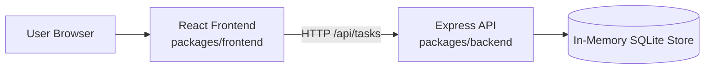
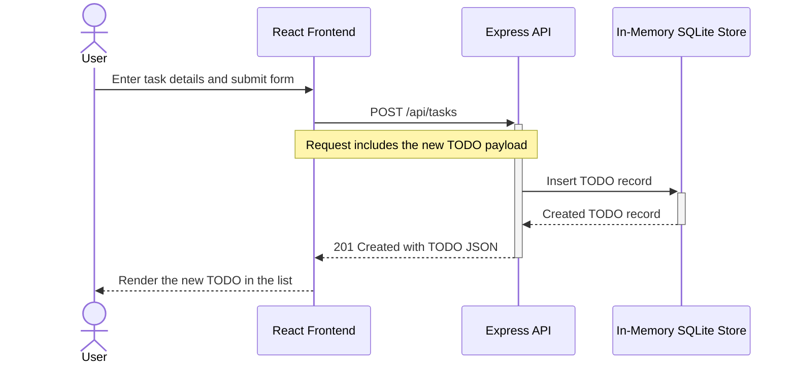

# Cloud Architecture Overview

This monorepo contains a React frontend, an Express API, and an in-memory SQLite store used by the backend during runtime.

## Create TODO Sequence

## Notes

- The browser loads the React application from the frontend package.
- The React app sends task requests to the Express API.
- The Express API reads from and writes to an in-memory SQLite database.
- The in-memory store is reset when the backend process restarts.